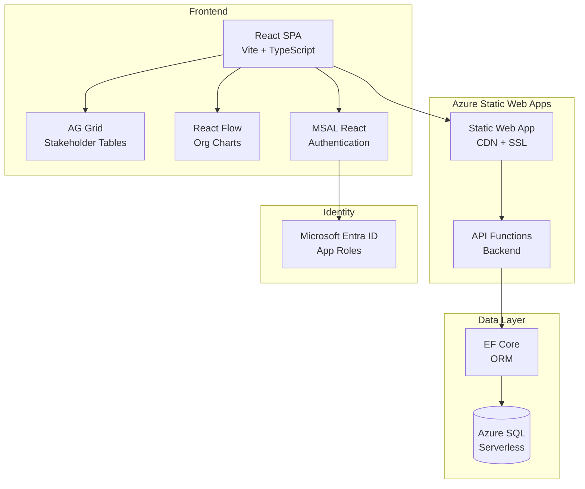

<!-- markdownlint-disable-file -->
# Task Research: Stakeholder Application Technology Stack

Research the best technology options for building the Stakeholder application based on the vision document requirements.

## Task Implementation Requests

* Research SPA Framework options suitable for Azure Web Application deployment
* Research Data Persistence options for multi-user stakeholder data management
* Research RBAC implementation options for access control and permissions

## Scope and Success Criteria

* Scope: Evaluate technology options that align with Azure deployment, Bicep IaC, GitHub Actions CI/CD, and multi-user requirements
* Assumptions:
  * Application will be deployed as Azure Web Application
  * Must support multi-user concurrent access
  * Development team has moderate experience with modern web technologies
  * Budget considerations favor Azure-native solutions where practical
* Success Criteria:
  * One recommended SPA framework with clear rationale
  * One recommended data persistence solution with schema considerations
  * One recommended RBAC approach integrated with Azure
  * All recommendations include Bicep deployment considerations

## Outline

1. SPA Framework Analysis
2. Data Persistence Analysis
3. RBAC Implementation Analysis
4. Integration Considerations
5. Recommended Architecture

### Potential Next Research

* API layer implementation (ASP.NET Core vs Azure Functions)
* Graph visualization library deep-dive (React Flow customization)
* RACI chart component design patterns
* Database migration and seeding strategies
* CI/CD pipeline detailed configuration

## Research Executed

### Subagent Research Files

| Topic | File | Status |
|-------|------|--------|
| SPA Framework | [spa-framework-research.md](.copilot-tracking/subagent/2026-02-01/spa-framework-research.md) | Complete |
| Data Persistence | [data-persistence-research.md](.copilot-tracking/subagent/2026-02-01/data-persistence-research.md) | Complete |
| RBAC | [rbac-research.md](.copilot-tracking/subagent/2026-02-01/rbac-research.md) | Complete |

### Project Conventions

* Azure Web Application deployment via Bicep IaC
* GitHub Actions for CI/CD
* GitHub Issues for tracking
* Multi-user access with RBAC
* JSON import/export capability

---

## Key Discoveries

### Recommended Technology Stack

| Component | Recommendation | Alternative |
|-----------|----------------|-------------|
| **SPA Framework** | React 18+ with TypeScript | Vue 3 with TypeScript |
| **Build Tool** | Vite | Create React App |
| **UI Components** | shadcn/ui (Radix primitives) | MUI, Chakra UI |
| **Data Grid** | AG Grid Community | TanStack Table |
| **Graph Visualization** | React Flow | Cytoscape.js |
| **State Management** | Zustand + TanStack Query | Redux Toolkit |
| **Data Persistence** | Azure SQL Database (Serverless) | Azure Cosmos DB NoSQL |
| **ORM** | Entity Framework Core | Dapper |
| **Authentication** | MSAL React | App Service Easy Auth |
| **Authorization** | Microsoft Entra App Roles | Custom JWT claims |
| **Deployment** | Azure Static Web Apps + Azure SQL | Azure App Service |

### Why These Choices

**React over Vue/Angular/Svelte:**
- Largest ecosystem for data grids and graph visualization
- React Flow is purpose-built for organizational charts and relationship graphs
- AG Grid has first-class React support
- Most Azure documentation and examples use React
- Largest talent pool for hiring and community support

**Azure SQL Database over Cosmos DB:**
- Stakeholder data is inherently relational (many-to-many relationships)
- Foreign key constraints ensure data integrity for critical relationship data
- Recursive CTEs handle reporting hierarchies efficiently
- Serverless tier auto-pauses for cost savings with variable usage patterns
- EF Core provides excellent development experience with migrations and LINQ
- JSON import/export built-in via `FOR JSON PATH` and `OPENJSON`

**MSAL over Easy Auth:**
- Works identically in local development and production
- Full control over authentication UX
- Role claims available directly in ID token for UI rendering
- No deployment required for testing authentication flows

---

## Technical Scenarios

### Scenario 1: SPA Architecture

**Requirements:**
- Tabular views with customizable columns and filters
- Graph visualization for organizational/influence relationships
- RACI chart views
- CSV/JSON export
- Responsive design

**Preferred Approach: React + Vite + shadcn/ui**

```text
stakeholder/
├── src/
│   ├── components/
│   │   ├── ui/                    # shadcn/ui components
│   │   ├── stakeholder-grid/      # AG Grid wrapper
│   │   ├── relationship-graph/    # React Flow wrapper
│   │   └── raci-chart/            # Custom RACI component
│   ├── features/
│   │   ├── people/
│   │   ├── teams/
│   │   ├── companies/
│   │   └── workstreams/
│   ├── lib/
│   │   ├── auth/                  # MSAL configuration
│   │   ├── api/                   # API client
│   │   └── export/                # CSV/JSON export utilities
│   └── App.tsx
├── public/
├── vite.config.ts
└── package.json
```

**Key Libraries:**

| Purpose | Library | Version |
|---------|---------|---------|
| Data Grid | ag-grid-react | ^31.x |
| Graph | @xyflow/react (React Flow) | ^12.x |
| CSV Export | papaparse | ^5.x |
| State | zustand | ^4.x |
| Server State | @tanstack/react-query | ^5.x |
| Router | react-router-dom | ^6.x |

**Implementation Details:**

AG Grid configuration for stakeholder tables:
```typescript
const columnDefs = [
  { field: 'firstName', filter: true, sortable: true },
  { field: 'lastName', filter: true, sortable: true },
  { field: 'email', filter: true },
  { field: 'company', filter: true },
  { field: 'timeZone', filter: true },
  { field: 'role', filter: true },
  { field: 'isActive', filter: true }
];
```

React Flow configuration for org charts:
```typescript
const nodeTypes = {
  person: PersonNode,
  team: TeamNode,
  company: CompanyNode
};

const edgeTypes = {
  reportsTo: ReportsToEdge,
  influences: InfluencesEdge,
  memberOf: MemberOfEdge
};
```

#### Considered Alternatives

**Vue 3:** Good alternative if team has Vue experience. vue-flow provides similar capabilities to React Flow. Smaller ecosystem but excellent documentation.

**Angular:** Too heavyweight for this project size. Steeper learning curve doesn't justify benefits for a stakeholder management application.

**Svelte:** Ecosystem too limited for data grid and graph visualization requirements. Would require significant custom development.

---

### Scenario 2: Data Persistence Architecture

**Requirements:**
- Store Data Sets, Companies, Workstreams, Teams, People
- Complex relationships: Reports-To, People-Teams, Influence
- Multi-user concurrent access
- JSON import/export
- Support for "inactive" stakeholder filtering

**Preferred Approach: Azure SQL Database Serverless + EF Core**

```text
Database Schema:
┌──────────────┐     ┌──────────────┐
│  DataSets    │     │  Companies   │
├──────────────┤     ├──────────────┤
│ Id (PK)      │     │ Id (PK)      │
│ Name         │     │ DataSetId FK │
│ OwnerName    │     │ Name         │
│ OwnerEmail   │     │ Website      │
└──────────────┘     │ HQLocation   │
                     └──────────────┘
                            │
┌──────────────┐     ┌──────────────┐
│  Workstreams │     │   Teams      │
├──────────────┤     ├──────────────┤
│ Id (PK)      │     │ Id (PK)      │
│ DataSetId FK │     │ DataSetId FK │
│ Name         │     │ Name         │
│ Description  │     │ Description  │
│ AdoLink      │     └──────────────┘
└──────────────┘            │
                     ┌──────┴──────┐
                     │ CompanyTeams│
                     │ M:N Junction│
                     └─────────────┘

┌──────────────┐     ┌─────────────────┐
│   People     │     │ InfluenceRels   │
├──────────────┤     ├─────────────────┤
│ Id (PK)      │     │ InfluencerId FK │
│ DataSetId FK │     │ InfluenceeId FK │
│ ManagerId FK │◄────│                 │
│ FirstName    │     └─────────────────┘
│ LastName     │
│ PreferredName│     ┌─────────────────┐
│ Email        │     │  PeopleTeams    │
│ Phone        │     │  M:N Junction   │
│ Location     │     └─────────────────┘
│ TimeZone     │
│ Title        │     ┌─────────────────┐
│ Role         │     │PeopleWorkstreams│
│ Notes        │     │  M:N Junction   │
│ IsActive     │     └─────────────────┘
└──────────────┘
```

**Bicep Deployment:**

```bicep
resource sqlServer 'Microsoft.Sql/servers@2023-05-01-preview' = {
  name: 'stakeholder-sql-${uniqueString(resourceGroup().id)}'
  location: location
  properties: {
    administratorLogin: administratorLogin
    administratorLoginPassword: administratorPassword
  }
}

resource sqlDatabase 'Microsoft.Sql/servers/databases@2023-05-01-preview' = {
  parent: sqlServer
  name: 'stakeholder-db'
  location: location
  sku: {
    name: 'GP_S_Gen5_1'  // Serverless General Purpose
    tier: 'GeneralPurpose'
  }
  properties: {
    autoPauseDelay: 60  // Pause after 60 mins idle
    minCapacity: 0.5
  }
}
```

**Estimated Monthly Cost:** $5-50 (variable based on usage, auto-pause reduces costs)

**Local Development:** SQL Server in Docker or LocalDB

```bash
docker run -e "ACCEPT_EULA=Y" -e "SA_PASSWORD=YourStrong@Passw0rd" \
  -p 1433:1433 --name stakeholder-sql \
  mcr.microsoft.com/mssql/server:2022-latest
```

#### Considered Alternatives

**Azure Cosmos DB NoSQL:** Better for schema flexibility and global distribution. Consider if stakeholder data model evolves frequently or global multi-region access becomes necessary.

**Azure PostgreSQL:** Good alternative with similar capabilities. Choose if open-source preference or specific PostgreSQL features needed.

---

### Scenario 3: RBAC Architecture

**Requirements:**
- Multi-user access management
- Role-based permissions (Admin, Editor, Viewer)
- Persona mapping: Decision Maker → Admin, Project Manager → Editor, Team Member → Viewer
- Works in local development

**Preferred Approach: MSAL React + Microsoft Entra App Roles**

```text
Authentication Flow:
┌─────────────────┐     ┌──────────────────┐
│  React SPA      │────►│ Microsoft Entra  │
│  (MSAL React)   │◄────│  ID              │
└─────────────────┘     └──────────────────┘
         │                       │
         │ ID Token with         │ App Roles:
         │ roles claim           │ - Admin
         │                       │ - Editor
         ▼                       │ - Viewer
┌─────────────────┐              │
│ Role-based UI   │◄─────────────┘
│ Rendering       │
└─────────────────┘
```

**App Role Definitions (Microsoft Entra manifest):**

```json
{
  "appRoles": [
    {
      "allowedMemberTypes": ["User"],
      "displayName": "Admin",
      "id": "00000000-0000-0000-0000-000000000001",
      "isEnabled": true,
      "description": "Full access to manage stakeholders and settings",
      "value": "Admin"
    },
    {
      "allowedMemberTypes": ["User"],
      "displayName": "Editor",
      "id": "00000000-0000-0000-0000-000000000002",
      "isEnabled": true,
      "description": "Can view and edit stakeholder data",
      "value": "Editor"
    },
    {
      "allowedMemberTypes": ["User"],
      "displayName": "Viewer",
      "id": "00000000-0000-0000-0000-000000000003",
      "isEnabled": true,
      "description": "Read-only access to stakeholder data",
      "value": "Viewer"
    }
  ]
}
```

**React Hook for Role Checking:**

```typescript
function useRoles() {
  const { accounts } = useMsal();
  const roles = accounts[0]?.idTokenClaims?.roles || [];
  
  return {
    isAdmin: roles.includes("Admin"),
    isEditor: roles.includes("Editor"),
    isViewer: roles.includes("Viewer"),
    canEdit: roles.includes("Admin") || roles.includes("Editor"),
    canManage: roles.includes("Admin"),
  };
}
```

**Estimated Monthly Cost:** $0 (Microsoft Entra Free tier includes app roles up to 50K MAU)

#### Considered Alternatives

**App Service Easy Auth:** Simpler setup but no local development support. Consider adding as secondary layer for API protection.

**Custom JWT:** More flexibility but requires building token infrastructure. Only consider if integrating with non-Microsoft identity providers.

---

## Recommended Architecture Overview



---

## Implementation Roadmap

### Phase 1: Foundation (Week 1-2)

1. Initialize React project with Vite and TypeScript
2. Set up shadcn/ui component library
3. Configure MSAL React authentication
4. Create Microsoft Entra app registration with roles
5. Deploy Azure SQL Database via Bicep
6. Implement EF Core DbContext with initial schema

### Phase 2: Core Features (Week 3-4)

1. Implement AG Grid for stakeholder tables
2. Build CRUD operations for all entities
3. Implement people management with relationships
4. Add filtering for active/inactive stakeholders
5. Build JSON import/export functionality

### Phase 3: Visualization (Week 5-6)

1. Implement React Flow for organizational graphs
2. Build influence relationship visualization
3. Create RACI chart component
4. Add CSV export for tabular views

### Phase 4: Polish & Deploy (Week 7-8)

1. Implement saved/reusable views
2. Configure Azure Static Web Apps deployment
3. Set up GitHub Actions CI/CD
4. Testing and bug fixes
5. Documentation

---

## Next Steps for Planning

1. **Clear context** by typing `/clear`
2. **Attach research file** [2026-02-01-stakeholder-tech-stack-research.md](.copilot-tracking/research/2026-02-01-stakeholder-tech-stack-research.md)
3. **Start planning** by typing `/task-plan`

---

## References

### Azure Documentation

- [Azure Static Web Apps](https://learn.microsoft.com/en-us/azure/static-web-apps/)
- [Azure SQL Database Serverless](https://learn.microsoft.com/en-us/azure/azure-sql/database/serverless-tier-overview)
- [Microsoft Entra ID for SPAs](https://learn.microsoft.com/en-us/entra/identity-platform/tutorial-single-page-app-react-prepare-app)
- [Bicep deployment templates](https://learn.microsoft.com/en-us/azure/azure-resource-manager/bicep/)

### Library Documentation

- [React](https://react.dev/)
- [AG Grid React](https://www.ag-grid.com/react-data-grid/)
- [React Flow](https://reactflow.dev/)
- [MSAL React](https://www.npmjs.com/package/@azure/msal-react)
- [Entity Framework Core](https://learn.microsoft.com/en-us/ef/core/)
